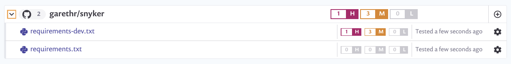

# Snyker

A vulnerable AWS Lambda application used for demonstration purposes.

## Vulnerabilities

Snyker has both runtime and development dependencies, and both are checked by Snyk for known security issues. Snyk is integrated via GitHub, and automatically detects any `requirements` files. Chalice also uses `requirements.txt` for managing dependencies. However, Snyker uses Poetry to manage it dependencies. To bridge this gap we have a GitHub Action which will generate the `requirements` files whenever the Poetry dependencies are changed. You can also do this manually

## Configuring Chalice for production

[Chalice](https://github.com/aws/chalice) is a nice microframework for building Python applications on Lambda, but like many such frameworks it needs you to do much of the configuration. This sample application includes a basic confuguration mechanism using AWS Systems Manager Parameter Store, as well as configuring structured logging.

